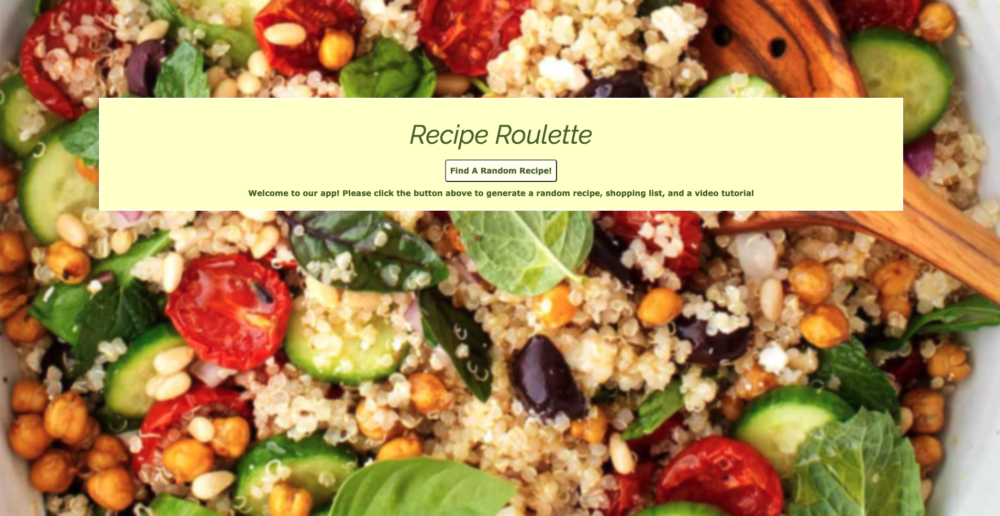
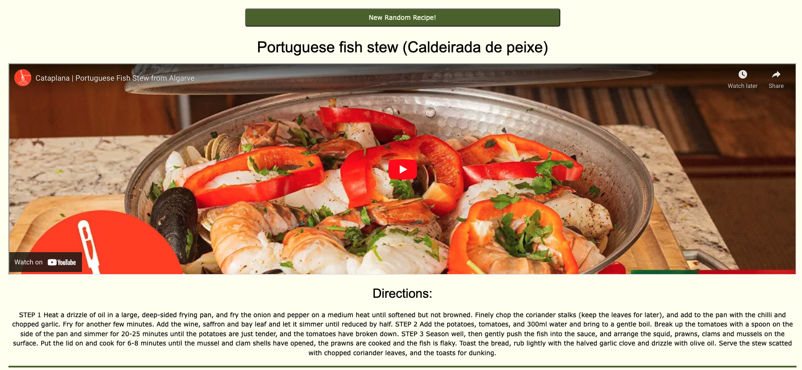
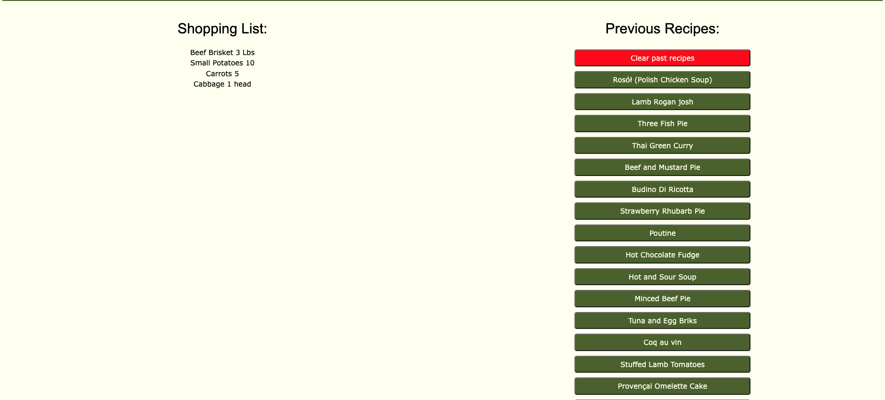

# project-01: Recipe Roulette 🥗

## Description:
The app will allow you to randomly generate a recipe along with a shopping list tailored to the ingredients needed to make the meal, as well as display an applicable YouTube video. The app will also store previous recipe results. 

This is for all of the busy Moms in the world having a hard time deciding what to make. 

Screenshots: 

---

## Getting Started: 
No installation or download necessary. Just open your browser 🍝

---

## Built With: 
HTML 

CSS/W3.CSS 

JQuery 

JavaScript 

MealMD API

---

## Authors: 
Ava Steimle 

Chris Muto 

Oscar Silva 

Special Thanks to: 
David Luu 